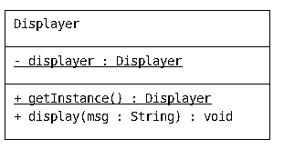

# Auteur : 
### Plancke Aurelien
### Plé Lucas 

# Introduction

Ce projet à un but simple, simuler l'organisation de compétition entre différents joueurs avec la possibilité d'avoir des règles spécifiques au déroulement de la compétition et au fonctionnement interne de cette compétition, par le biais du type de match. 
Bien que ce projet soit simple en apparance, dans le cadre d'un cours de Conception Orientée Objet, nous avons dû mettre en place plusieurs principes nous permettant d'avoir un code qui puisse évoluer facilement, qui respecte les principes du clean code et open-close par exemple. C'est ce que nous avons développé avec ce projet, un code qui peut facilement ajouter de nouvelles classes sans devoir refaire les fondations du projet.

# Prérequis 

Le projet à été développé en Java 11 mais il est possible de le lancer sur des versions ultérieurs. Junit5 est quand à lui indispensable pour lancer les tests. Une archive jar est présente dans le dossier `lib` du projet permettant de lancer les tests directement en ligne de commandes.

# HowTo


## Récupération du dépot : 

Si vous avez une clef ssh lancez :
```shell
git clone git@gitlab-etu.fil.univ-lille1.fr:ple/ple_lucas_plancke_aurelien-coo-projet.git
```

Sinon lancez la commande suivante qui vous demandera d'utiliser vos informations de connexion au gitlab du fil:
```shell 
git clone https://gitlab-etu.fil.univ-lille1.fr/ple/ple_lucas_plancke_aurelien-coo-projet.git
```

## Compilation en jar du projet
Pour compiler le projet et générer le jar du projet en partant de la racine du projet : 
```shell 
cd ple_lucas_plancke_aurelien-coo-projet
./compile.sh
cd bin 
jar cvfm ../ProjetCOO.jar ../MANIFEST.MF fr/ulille/l3 -C .. ressources
cd ..
```

## Lancement du projet
Pour lancer le projet : 
```shell 
java -jar ProjetCOO.jar
```

## Compilation et lancement des tests
Pour compiler les tests et les lancer en partant de la racine du projet: 
```shell 
./compile.sh
```
```shell
java -jar lib/Junit-console.jar --class-path bin/ --scan-class-path
```

## Génération de la documentation
En partant de la racine du projet : 
```shell
cd src
javadoc -d ../doc -subpackages fr  
cd ..
```

La documentation sera généré à l'emplacement suivant :
```shell
cd doc
```
Vous pouvez y acceder avec la commande
```shell
firefox index.html
```

# Diagrammes UML

## Competition V1


## Competition V2


## Matchs


## Modèle


## Strategy 


## Exception V1


## Exception V2


## MapUtil


## Displayer V1


## Displayer V2


## Enum type of competition


## Architecture design pattern Observateur/Observé


## Matchs V3


# Principes et éléments de conceptions important utilisé.

Dans le cadre du principe open-close nous avons mis en place une structure qui permet de respecter ce principe. En voici quelques éléments :


## Abstract classes pour les matchs et compétitions

Ces classes abstraites sont un point essentiel du projet. En effet nous savons que les compétitions et les matchs sont amenés à se diversifier, c'est pourquoi nous avons décidé de mettre en place de l'héritage par le biais des classes abstraites afin de définir un comportement commun entre tout les types de matchs et tout les types de compétitions. Avec ces classes abstraites, si nous rajoutons un type de match ou de compétition, il suffit d'étendre ces classes abstraites et nous n'avons pas à modifier le fonctionnement même du programme comme nous pouvons décrire un comportement spécifique dans les sous-classes.

## Design pattern de singleton pour le displayer

Le displayer est la classe qui centralise les affichages. Il n'y a aucune raison d'instancier plus d'une fois de cette classe, le singleton nous permet donc d'éviter cela en limitant le nombre d'exemplaire de cette classe à 1. Cela permet d'économiser des ressources et s'assurer que nous utilisons toujours la même instance, nous facilitant ainsi la tâche pour l'initialisation et donc potentiellement le débuggage. 

## Héritage de tests 

Comme pour les matchs et compétitions, les tests qui concernent ces différentes classes regroupent des comportements communs. En installant une relation d'héritage avec l'aide de classes abstraites, cela nous permet de tester les comportements communs facilement sans devoir réécrire pour chaque nouvelle classe le même test. En plus de cela grâce à cet héritage, nous pouvons faire des tests spécifiques pour une sous-classe.

## Prise en compte des remarques sur la V1
### Nom des paquetages
Lorsque nous avons construit le squelette du projet, nous avons nommé nos paquetages 'main.java.fr.ulille.l3.paquetage'. Il se trouve que 'main' est un mauvais nom de paquetage et qu'il vaut mieux laisser 'java' à Oracle et ne pas l'utiliser. Nous avons donc préféré simplement retirer ces paquetages pour ainsi avoir une arborescence du type 'fr.ulille.l3.paquetage'.

### Displayer
Pour gérer les affichages de toutes les classes, nous avons crée un Displayer. Cependant le Displayer était implémenté directement dans une classe instanciable, sans abstraction. C'est pourquoi nous avons crée une interface qui permet de définir un Displayer comme on le souhaite, et surtout d'en créer plusieurs répondants à différents besoins comme afficher dans la console, un flux, ne rien afficher ... Vous trouverez des détails sur cette interface plus loin dans ce README.

## Competition factory et singleton (V2)

Nous avons décidé d'implémenter une factory pour créer les différentes compétitions. Cela nous permet de centraliser toutes les instanciations à un seul endroit. En plus de respecter le principe SOLID, cela permettra dans le futur de tester plus facilement les classes qui utilisent cette factory. Nous avons également ajouté un singleton pour s'assurer qu'une seule instance de cette factory existe car il n'y a pas de raison d'avoir plusieurs instances.

## Strategy factory et singleton (V2)

De même que pour la competition factory, nous sommes amenés à faire évoluer notre code pour ajouter des stratégie de sélection, c'est pourquoi nous avons mis en place une factory. 

## Interface displayer (V2)

Nous avons créé une interface pour les displayer. Le but est simple, pouvoir créer différents displayer et être ainsi plus flexible sur l'affichage. Pour donner un exemple nous pouvons désormais créer un displayer pour le fonctionnement normal du programme qui produira l'affichage voulu et d'un autre côté en avoir un prévu pour les tests qui ne produira aucun affichage, ce qui permet aux résultats des tests de ne pas être noyés dans des affichages.

## Selection Strategy (V2)

Ce design pattern (strategy) à été utilisé dans la V2 du projet afin de mieux respecter les valeurs de l'open closed. En effet grâce à cette strategy nous pouvons décider de juste implémenter une nouvelle classe qui implémente l'interface Selection Strategy et redéfinir le mode de sélection de la première phase à la seconde phase d'un master. De ce fait nous n'avons pas besoin de modifier le code de la classe master. 

## Enum enrichie typeOfCompetition (V2)

Nous avons décidé de créer également une énumeration enrichie qui ne sert pour le moment que pour les noms des différentes compétitions, cette énumération nous permet de centraliser les Strings que nous utilisons dans le code pour décider quelle compétition créer. Cela permet d'uniformiser ces Strings dans tout le code.

## Enum enrichie typeOfStrategy (V2)

Pour les mêmes raison que l'énum précédente, nous avons créé cette enum enrichie pour les types de stratégie. Nous avons également rajouté un paramètres au type typeOfStrategy qui nous permet d'obtenir la description de la stratégie pour l'affichage.

## Héritage d'exception (V2)

Nous avons rajouté une couche d'abstraction au niveau des exceptions. Cela nous permet de regrouper les exceptions concernant les problèmes de création de compétitions sous la même classe, CannotCreateCompetitionException. En plus d'améliorer la visibilté, cela nous permet de throws ce type d'exception dans l'abstraction de compétition.

# V2 Remarques générales

Dans cette V2 nous devions implémenter un nouveau type de compétition nommé Master. Cette compétition est prévue de telle sorte à avoir une première phase de qualifications, une de sélection et finalement une phase finale avec les joueurs sélectionnés. Pour réaliser cette V2, nous avons donc décidé de reprendre ce que nous avions déjà créé, nous avons donc effectué ce fonctionnement avec le principe suivant : une liste de compétition qui représente la première partie du master, chaque compétition dans cette liste étant joué une par une. Pour la selection nous avons, comme vu précédemment, implémenter un design pattern de strategy pour pouvoir définir les règles d'accessibilité à la phase finale. Pour finir, la phase finale est définie comme un Tournament qui est joué avec les joueurs qualifiés. Cette implémentation était assez facile à réaliser comme nous avions pensé au principe open-closed dès la v1. Nous avons également rajouté une méthode qui permet pour chaque compétition de vérifier si celle-ci est créable. A la fin de chaque constructeur, cette méthode est appelée et vérifiera selon le type de compétition et ses paramètres de création s'il est possible de l'instancier.

## Prise en compte des remarques sur la V2
### Méthode play du master
Nous avons simplement rajouté une méthode permettant de mieux décomposer l'exécution du master. Nous avons juste mis l'exécution de la phase finale du master dans une méthode pour que le play du master tienne en trois appels de fonctions. 

### Ranking final du master
Dans la version 2 du projet, lorsqu'on jouait un master, nous avions juste les affichages des classements de chaque poule et de la phase finale du tournoi. Cependant, nous n'avions pas de résultat global de la compétition. Il fallait donc calculer ce classement final en ajoutant le nombre de matchs gagnés par les compétiteurs ayant atteint la phase finale au nombre de matchs qu'ils avaient déjà gagné pendant les poules. C'est pour ça que le gagnant de la compétition n'est pas forcément le compétiteur ayant remporté le plus de matchs. L'affichage de la fin d'un master permet donc de voir le classement de la phase finale, puis juste après le classement global de la compétition.

### Vérification de l'appel à la méthode de sélection de la stratégie lorsqu'on joue un master
Nous n'avons pas pensé lors de l'implémentation des tests sur le master à vérifier si la méthode de sélection de la stratégie était correctement appelé lors de l'exécution d'un Master. Nous avons donc rajouté ce test pour s'en assurer. Ce test consiste en récupérer la liste des poules d'un Master ainsi que sa stratégie et de comparer les compétiteurs qui devraient être sélectionnés en fonction de leur classement dans les différentes poules et ceux qui ont réellement été selectionné pour la phase finale. Il faut donc jouer le master pour comparer ces deux ensembles. S'ils sont égaux, c'est que la méthode de sélection a été appelé et a correctement fonctionné.

### Remarques sur les stratégies
Lors du rendu de la deuxième version du projet, nous avons simplement évoqué l'implémentation des stratégies par le biais du design pattern du même nom : Strategy. Nous allons ici donner quelques précisions, notamment comment créer de nouvelles stratégies dans ce projet. Il faut d'abord créer la nouvelle strategie dans le paquetage 'fr.ulille.l3.strategy' et lui faire implémenter l'interface 'SelectionStrategy'. Il faudra définir la méthode `selection` qui gère la selection spécifique à cette stratégie. La méthode `numberOfCompetitorsSelected` devra simplement retourner le nombre de compétiteurs sélectionné en fonction des poules gérées par cette instance de la stratégie. Une fois cette implémentation terminée, il faudra rajouter la possibilité à la fabrique de stratégies d'instancier ce nouveau de stratégie. Il faudra également ajouter à l'enumération des types de stratégies un élément portant le nom de la stratégie nouvellement créée, avec une chaine de caractère reprenant simplement son nom et une description qui sera directement affichée lors de l'exécution du programme. 

## Pattern observateur/observé (V3)
Le but de ce troisième rendu était de pouvoir avoir des journalistes et des bookmakers actif sur une compétition que l'on joue. Pour ce faire, il faut que tous les journalistes et bookmakers observent chaque match d'une compétition. Quand un match est fini, ils sont tous notifiés du résultat du match : ils pourront ainsi mettre à jour leurs côtes ou écrire simplement un message parlant du match. On voit donc que les bookmakers et les journalistes opèrent de la même façon, il fallait donc un niveau d'abstraction commun à ces observateurs. La façon la plus simple de résoudre ce problème est d'implémenter un pattern observateur/observé. Il permet de réaliser exactement ce que l'on souhaite ici. Nous allons alors attacher à chaque compétition une liste d'observateur et, à chaque que l'on joue un match, on notifiera ces observateurs pour qu'ils puissent réaliser leurs actions respectives. Comme n'importe quelle compétition doit pouvoir accueillir des journalistes et des bookmakers, nous avons crée une classe abstraite répondant simplement en pattern en maintenant une liste d'observateur. La classe abstraite Competition hérite maintenant de cette nouvelle abstraction. Cela permet aussi de faire évoluer plus simplement le code et de créer des objets qui n'ont pas de rapport avec les compétitions mais qui doivent aussi implémenter ce design pattern. 

Pour les League et les Tournament, tout s'est fait directement lors de l'héritage de Competition à SpecialObservable. Pour les Master par contre, il fallait faire attention à garder les côtes des bookmakers même lorsque l'on passe des phases de poules à la phase finale. Pour ça, il faut dire à tous les observateurs du Master d'observer les phases de poules lorsqu'on les joue et la phase finale lorsqu'elle est jouée. C'est pourquoi les observateurs ont tous un attribut pointant vers la compétition qu'ils observent. On peut facilement changer cet attribut sans changer ce qu'ils maintiennent, comme les côtes pour les bookmakers.

## Changement de la gestion des matchs (V3)
Jusqu'ici à l'issue d'un match, nous affichions directement le gagnant du match sans le sauvegarder quelque aprt. Cependant, il faut maintenant que les observateurs des compétitions puissent également savoir qui a remporté et qui a perdu le match pour leurs différentes actions. C'est pourquoi nous avons décidé d'ajouter deux attributs à la classe abstraite Match : le gagnant et le perdant. Ceux-ci sont initialisés à l'issue du match. Cela permet donc de récupérer plus tard le résultat de chaque match. Les observateurs pourront alors effectuer correctement leur travail après le match. Ils pourront le réaliser seulement si ils ont chacun accès au résultat du dernier match joué dans la compétition. Nous avons donc rajouté un attribut dans Competition permettant d'identifier le dernier match joué. Cet attribut sera mis à jour à chaque appel de la méthode playMatch qui notifie également tous les observateurs. Ces derniers auront alors accès au dernier match joué et pourront faire leur travail. 

Nous avons également apporté une petite amélioration concernant la fabrique de match : celle-ci fonctionne maintenant avec une énumération de la même façon que pour les stratégies. Cela permet d'eventuellement faire évoluer le code plus facilement si l'on souhaite rajouter des types de matchs.

## Tests du design pattern observateur/observé (V3)
Pour tester ce design pattern, on souhaite simplement savoir si les quelques méthodes qu'implémente ce pattern sont appelées correctement. Nous avons donc choisi ici de créer des Mocks pour un observateur et on observé. Ces mocks ne réalisent aucunes actions spécifiques, ils sont simplement là pour implémenter l'interface observateur et étendre la super-classe d'observé. Cela nous permet de tester à part le fonctionnement du pattern sans utiliser des compétitions déjà implémentées. On doit simplement s'assurer que les observateurs sont correctement notifiés et qu'ils réalisent leurs actions respectives. Nous n'avons pas besoin ici de contrôler leur effet sur des competitions puisque cela n'est pas l'optique de ces tests.

## Tests sur les journalistes et les bookmakers
Contrairement à la section précédente, on veut ici tester réellement les comportements des journalistes et des bookmakers. Nous avons ici procédé de la même façon que pour les tests en lien avec les compétitions en utilisant de l'héritage de tests. Le test commun à tous les observateurs est qu'ils doivent bien observer une compétition, il faut vérifier que celle-ci est correcte. Les autres tests sont spécifiques au type d'observateur. Il faut vérifier que les côtes sont correctement initialisées et mises à jour après un match pour les bookmakers. Les journalistes ne réalisent que de l'affichage, ils n'ont pas d'autres comportements spécifiques.