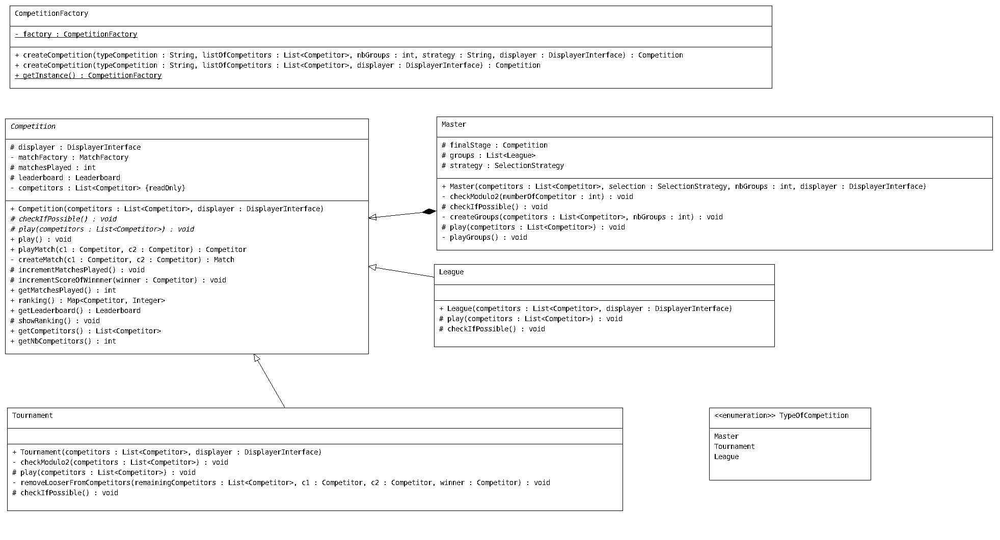

# Auteur : 
### Plancke Aurelien
### Plé Lucas 

# Introduction

Ce projet à un but simple, simuler l'organisation de compétition entre différents joueurs avec la possibilité d'avoir des règles spécifiques au déroulement de la compétition et au fonctionnement interne de cette compétition, par le biais du type de match. 
Bien que ce projet soit simple en apparance, dans le cadre d'un cours de Conception Orientée Objet, nous avons dû mettre en place plusieurs principes nous permettant d'avoir un code qui puisse évoluer facilement, qui respecte les principes du clean code et open-close par exemple. C'est ce que nous avons développé avec ce projet, un code qui peut facilement ajouter de nouvelles classes sans devoir refaire les fondations du projet.

# Prérequis 

Le projet à été développé en Java 11 mais il est possible de le lancer sur des versions ultérieurs. Junit5 est quand à lui indispensable pour lancer les tests. Une archive jar est présente dans le dossier `lib` du projet permettant de lancer les tests directement en ligne de commandes.

# HowTo


## Récupération du dépot : 

Si vous avez une clef ssh lancez :
```shell
git clone git@gitlab-etu.fil.univ-lille1.fr:ple/ple_lucas_plancke_aurelien-coo-projet.git
```

Sinon lancez la commande suivante qui vous demandera d'utiliser vos informations de connexion au gitlab du fil:
```shell 
git clone https://gitlab-etu.fil.univ-lille1.fr/ple/ple_lucas_plancke_aurelien-coo-projet.git
```

## Compilation en jar du projet
Pour compiler le projet et générer le jar du projet en partant de la racine du projet : 
```shell 
cd ple_lucas_plancke_aurelien-coo-projet
./compile.sh
cd bin 
jar cvfm ../ProjetCOO.jar ../MANIFEST.MF fr/ulille/l3 res
cd ..
```

## Lancement du projet
Pour lancer le projet : 
```shell 
java -jar ProjetCOO.jar
```

## Compilation et lancement des tests
Pour compiler les tests et les lancer en partant de la racine du projet: 
```shell 
./compile.sh
```
```shell
java -jar lib/Junit-console.jar --class-path bin/ --scan-class-path
```

## Génération de la documentation
En partant de la racine du projet : 
```shell
cd src
javadoc -d ../doc -subpackages fr  
cd ..
```

La documentation sera généré à l'emplacement suivant :
```shell
cd doc
```
Vous pouvez y acceder avec la commande
```shell
firefox index.html
```

# Diagrammes UML

## Competition V1


## Competition V2


## Matchs


## Modèle


## Exception V1


## Exception V2


## Displayer V1


## Displayer V2


## Enum type of competition


# Principes et éléments de conceptions important utilisé.

Dans le cadre du principe open-close nous avons mis en place une structure qui permet de respecter ce principe. En voici quelques éléments :


## Abstract classes pour les matchs et compétitions

Ces classes abstraites sont un point essentiel du projet. En effet nous savons que les compétitions et les matchs sont amenés à se diversifier, c'est pourquoi nous avons décidé de mettre en place de l'héritage par le biais des classes abstraites afin de définir un comportement commun entre tout les types de matchs et tout les types de compétitions. Avec ces classes abstraites, si nous rajoutons un type de match ou de compétition, il suffit d'étendre ces classes abstraites et nous n'avons pas à modifier le fonctionnement même du programme comme nous pouvons décrire un comportement spécifique dans les sous-classes.

## Design pattern de singleton pour le displayer

Le displayer est la classe qui centralise les affichages. Il n'y a aucune raison d'instancier plus d'une fois de cette classe, le singleton nous permet donc d'éviter cela en limitant le nombre d'exemplaire de cette classe à 1. Cela permet d'économiser des ressources et s'assurer que nous utilisons toujours la même instance, nous facilitant ainsi la tâche pour l'initialisation et donc potentiellement le débuggage. 

## Héritage de tests 

Comme pour les matchs et compétitions, les tests qui concernent ces différentes classes regroupent des comportements communs. En installant une relation d'héritage avec l'aide de classes abstraites, cela nous permet de tester les comportements communs facilement sans devoir réécrire pour chaque nouvelle classe le même test. En plus de cela grâce à cet héritage, nous pouvons faire des tests spécifiques pour une sous-classe.

## Competition factory et singleton (V2)

Nous avons décidé d'implémenter une factory pour créer les différentes compétitions. Cela nous permet de centraliser toutes les instanciations à un seul endroit. En plus de respecter le principe SOLID, cela permettra dans le futur de tester plus facilement les classes qui utilisent cette factory. Nous avons également ajouté un singleton pour s'assurer qu'une seule instance de cette factory existe car il n'y a pas de raison d'avoir plusieurs instances.

## Interface displayer (V2)

Nous avons créé une interface pour les displayer. Le but est simple, pouvoir créer différents displayer et être ainsi plus flexible sur l'affichage. Pour donner un exemple nous pouvons désormais créer un displayer pour le fonctionnement normal du programme qui produira l'affichage voulu et d'un autre côté en avoir un prévu pour les tests qui ne produira aucun affichage, ce qui permet aux résultats des tests de ne pas être noyés dans des affichages.

## Selection Strategy (V2)

Ce design pattern (strategy) à été utilisé dans la V2 du projet afin de mieux respecter les valeurs de l'open closed. En effet grâce à cette strategy nous pouvons décider de juste implémenter une nouvelle classe qui implémente l'interface Selection Strategy et redéfinir le mode de sélection de la première phase à la seconde phase d'un master. De ce fait nous n'avons pas besoin de modifier le code de la classe master. 

## Enum typeOfCompetition (V2)

Nous avons décidé de créer également une énumeration enrichie qui ne sert pour le moment que pour les noms des différentes compétitions, cette énumération nous permet de centraliser les Strings que nous utilisons dans le code pour décider quelle compétition créer. Cela permet d'uniformiser ces Strings dans tout le code.

## Héritage d'exception (V2)

Nous avons rajouté une couche d'abstraction au niveau des exceptions. Cela nous permet de regrouper les exceptions concernant les problèmes de création de compétitions sous la même classe, CannotCreateCompetitionException. En plus d'améliorer la visibilté, cela nous permet de throws ce type d'exception dans l'abstraction de compétition.


# V2 Remarques générales

Dans cette V2 nous devions implémenter un nouveau type de compétition nommé Master. Cette compétition est prévue de telle sorte à avoir une première phase de qualifications, une de sélection et finalement une phase finale avec les joueurs sélectionnés. Pour réaliser cette V2, nous avons donc décidé de reprendre ce que nous avions déjà créé, nous avons donc effectué ce fonctionnement avec le principe suivant : une liste de compétition qui représente la première partie du master, chaque compétition dans cette liste étant joué une par une. Pour la selection nous avons, comme vu précédemment, implémenter un design pattern de strategy pour pouvoir définir les règles d'accessibilité à la phase finale. Pour finir, la phase finale est définie comme un Tournament qui est joué avec les joueurs qualifiés. Cette implémentation était assez facile à réaliser comme nous avions pensé au principe open-closed dès la v1. Nous avons également rajouté une méthode qui permet pour chaque compétition de vérifier si celle-ci est créable. A la fin de chaque constructeur, cette méthode est appelée et vérifiera selon le type de compétition et ses paramètres de création s'il est possible de l'instancier.